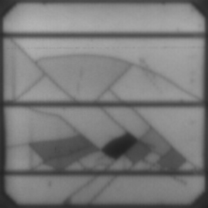

# Crack and Inactive Region Detection Using ResNet

## Project Overview
This project leverages deep learning-based image processing techniques to detect cracks and inactive regions in solar panels. Traditional manual inspection methods are labor-intensive, costly, and prone to inaccuracies. This deep learning approach significantly improves the efficiency, accuracy, and cost-effectiveness of solar panel maintenance.

## Key Benefits
- **High Accuracy**: Detects even micro-defects with 90-95% accuracy.
- **Faster Inspections**: Reduces inspection time from days to just a few hours for large solar farms.
- **Cost Savings**: Lowers maintenance and labor costs by up to 80%.
- **Proactive Maintenance**: Enables predictive maintenance to avoid performance drops and costly repairs.

## Method Comparison

| **Metric**              | **Manual/Traditional Methods**                 | **Image Processing (Deep Learning)**         |
|-------------------------|------------------------------------------------|----------------------------------------------|
| **Accuracy**            | 70-80% (highly dependent on human skill)       | 90-95% (able to detect micro-defects early)  |
| **Inspection Speed**    | 1-2 days per 100 panels (large farms can take weeks) | 2-3 hours per 100 panels                    |
| **Labor Cost (Annual)** | ~$100,000 for large farms (multiple technicians) | ~$20,000 (automated system maintenance)      |
| **Initial Setup Cost**  | ~$10,000-15,000 (equipment and tools)          | ~$50,000 (drones, cameras, model training)   |
| **Recurring Costs**     | ~$50,000/year (technician labor, travel, equipment maintenance) | ~$5,000/year (automated system upkeep) |
| **Downtime Cost**       | $5,000-$10,000 per inspection due to taking panels offline | Minimal downtime (~$1,000)                  |
| **Scalability**         | Limited (max 500 panels/day with large teams)  | Highly scalable (up to 5,000 panels/day)     |
| **Maintenance Approach**| Reactive (fault detected after performance drop) | Proactive (detects early defects, avoids major issues) |

## Features

- **Custom Dataset Loader**: Converts grayscale images to RGB and applies transformations such as horizontal/vertical flipping, color jittering, and normalization.
- **ResNet-50 Backbone**: Pretrained ResNet-50 model with modified final layers to adapt to binary classification (crack, inactive).
- **Weighted Loss Function**: Implements weighted BCEWithLogitsLoss to handle class imbalance in the dataset.
- **Early Stopping and Learning Rate Scheduler**: Uses ReduceLROnPlateau and early stopping to prevent overfitting.
- **Model Checkpointing**: Saves and restores the best model based on validation F1 score.
- **ONNX Export**: Supports exporting the best model as an ONNX file for deployment.

## Table of Contents

- [Installation](#installation)
- [Usage](#usage)
- [Project Structure](#project-structure)
- [Dataset](#dataset)
- [Model Architecture](#model-architecture)
- [Training](#training)
- [Evaluation](#evaluation)
- [Results](#results)
- [Exporting Model](#exporting-model)
- [References](#references)
- [Contributors](#contributors)

## Installation

To set up the environment for this project, install the required dependencies by running:

### Using requirements.txt
```bash
pip install -r requirements.txt
```
### Using environment.yml
Alternatively, you can create the environment using Conda with the following command:

```bash
conda env create -f environment.yml
```

---
## Usage
**Data Preparation**
The dataset should be provided as a CSV file (data.csv) with the following columns:

- **Image Path:** Path to the image files.
- **Crack Label:** Binary label (1 for crack, 0 for no crack).
- **Inactive Label:** Binary label (1 for inactive, 0 for active).

Ensure the images are in grayscale format. The code automatically handles the conversion to RGB.

### Example Images

Here are some example images from the dataset:

<div style="display: flex; justify-content: space-around;">

  <div style="margin: 10px;">
    
    <p>Image 1: Solar Panel with Both Crack and Inactive Regions</p>
  </div>

  <div style="margin: 10px;">
    
    <p>Image 2: Solar Panel with Both Crack and Inactive Regions</p>
  </div>

  <div style="margin: 10px;">
    
    <p>Image 3:Solar Panel with neither Crack nor Inactive Regions</p>
  </div>

  <div style="margin: 10px;">
    
    <p>Image 4: Solar Panel with only Cracks but no Inactive Regions</p>
  </div>

</div>


**Training**

To train the model, run:

```bash
python train.py
```
This will:

- Load the dataset from data.csv.
- Perform a 90-10 train-validation split.
- Train the model using the defined ResNet architecture.
- Apply early stopping based on the validation F1 score.
- Save the best model checkpoints.


---
## Project Structure
```plaintext
.
├── checkpoints/      # Folder to store model checkpoints
├── images/           # Folder containing training images
├── data.csv          # Folder containing image paths and corresponding labels
├── data.py           # Data loader and preprocessing logic
├── environment.yml   # Conda environment file
├── export_onnx.py    # Save the model in ONNX format
├── model.py          # ResNet-50 based model architecture
├── train.py          # Main script to train the model
├── trainer.py        # Trainer class handling training and evaluation
└── requirements.txt  # Required dependencies
```
---
## Dataset
The dataset consists of grayscale images that are converted to RGB before being fed into the model. The dataset is expected to have two labels:

- **Crack:** Binary label indicating the presence of cracks.
- **Inactive:** Binary label indicating inactive regions.

**Data Augmentation**
- Horizontal and Vertical Flip: Applied with a probability of 0.4 to improve model robustness.
- Color Jittering: Random adjustments to brightness, contrast, saturation, and hue.
- Normalization: Images are normalized using the mean and standard deviation of the training set.

---
## Model Architecture
The model is based on the ResNet-50 architecture, pretrained on ImageNet. The final layers are modified for binary classification:

```python
self.fc1 = torch.nn.Linear(2048, 512)
self.fc2 = torch.nn.Linear(512, 256)
self.fc3 = torch.nn.Linear(256, 2)  # Output for two binary classification tasks
```
### **Activation and Output**
- The final layer uses a sigmoid activation to output probabilities for the two binary classification tasks.
---
## Training
The training process uses the following components:
- **Loss Function:** Binary Cross-Entropy with Logits Loss (BCEWithLogitsLoss) with class weights to handle dataset imbalance.
- **Optimizer:** Adam optimizer (torch.optim.Adam) with a learning rate of 0.0001.
- **Learning Rate Scheduler:** Reduces learning rate if the validation F1 score plateaus.
- **Batch Size:** Default is 32.
- **Early Stopping:** Training will stop if the validation F1 score does not improve for 10 consecutive epochs to prevent overfitting.

---
## Evaluation
The validation process computes:

- **Loss:** Binary cross-entropy loss.
- **F1 Score:** The F1 score is used as the primary metric for evaluating model performance.
  
The best model based on the validation F1 score is saved. The F1 score is computed as:

```python
f1_score(true_labels, predictions, average='weighted')
```
---
## Results
- After training, the model achieved the highest F1 score of approximately **94%** on the training set and **93.7%** on the testing set. The model's performance (loss, F1 score) is visualized with a loss plot saved as [losses.png]. The best model is saved in the [checkpoints/] directory.
---
## Exporting Model
The best-performing model can be exported as an ONNX file for deployment:

```bash
python train.py
```
At the end of the training, the model is saved as an ONNX file:

```bash
best_model_epoch{epoch_number}.onnx
```
---
## References

- **ResNet Architecture**: He, K., Zhang, X., Ren, S., & Sun, J. (2016). Deep Residual Learning for Image Recognition. *Proceedings of the IEEE Conference on Computer Vision and Pattern Recognition (CVPR)*, 770-778. [Link to paper](https://arxiv.org/abs/1512.03385).
- **PyTorch ONNX Export**: PyTorch Documentation. [Link to documentation](https://pytorch.org/docs/stable/jit.html#torch.jit.trace).
---
## Contributors

If you have any questions or would like to contribute, please feel free to reach out to me at:

- **Email**: vipulpatil7057@gmail.com
- **Email**: sushantnemade15@gmail.com
